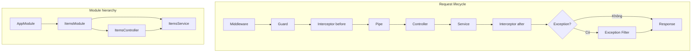

# Kiến trúc NestJS – Các tầng, module và thứ tự xử lý request

Tài liệu mô tả các **tầng (layers)**, **module** và **thứ tự** các thành phần khi một request đi vào ứng dụng NestJS.

---

## 1. Luồng xử lý một request (Request lifecycle)

Thứ tự các thành phần được gọi khi có HTTP request:

```
  Request từ client
         │
         ▼
  ┌─────────────────┐
  │   MIDDLEWARE    │  ← Chạy đầu tiên (log, parse, thêm header…)
  └────────┬────────┘
           │
           ▼
  ┌─────────────────┐
  │     GUARD       │  ← Kiểm tra quyền / xác thực (có được phép gọi không?)
  └────────┬────────┘
           │
           ▼
  ┌─────────────────┐
  │ INTERCEPTOR     │  ← Trước khi vào handler (có thể transform request)
  │   (before)      │
  └────────┬────────┘
           │
           ▼
  ┌─────────────────┐
  │      PIPE       │  ← Validate / transform tham số (body, query, param)
  └────────┬────────┘
           │
           ▼
  ┌─────────────────┐
  │   CONTROLLER    │  ← Route handler: nhận request, gọi service, return
  │   (route)       │
  └────────┬────────┘
           │
           ▼
  ┌─────────────────┐
  │    SERVICE      │  ← Logic nghiệp vụ (được controller gọi)
  │  (provider)     │
  └────────┬────────┘
           │
           ▼
  ┌─────────────────┐
  │ INTERCEPTOR     │  ← Sau khi handler chạy xong (transform response)
  │   (after)       │
  └────────┬────────┘
           │
           ▼
  ┌─────────────────┐
  │ EXCEPTION       │  ← Bắt exception (Guard/Pipe/Controller/Service throw)
  │    FILTER       │     → trả HTTP status + body lỗi cho client
  └────────┬────────┘
           │
           ▼
  Response trả về client
```

**Tóm tắt thứ tự:**  
Middleware → Guard → Interceptor (before) → Pipe → **Controller** → **Service** → Interceptor (after) → (nếu có lỗi) Exception Filter → Response.

---

## 2. Sơ đồ module và phụ thuộc

Cấu trúc module thường là **cây**: một module gốc (AppModule) import các feature module.

```
                    ┌──────────────────────┐
                    │      AppModule       │
                    │  (module gốc)        │
                    │                      │
                    │  • imports           │
                    │  • controllers       │
                    │  • providers         │
                    └──────────┬───────────┘
                               │
           ┌───────────────────┼───────────────────┐
           │                   │                   │
           ▼                   ▼                   ▼
  ┌─────────────────┐ ┌─────────────────┐ ┌─────────────────┐
  │   AppController │ │   ItemsModule    │ │ LoggerMiddleware │
  │   AppService    │ │  (feature)       │ │ (configure)      │
  └─────────────────┘ └────────┬────────┘ └─────────────────┘
                                │
                    ┌───────────┴───────────┐
                    │                       │
                    ▼                       ▼
           ┌─────────────────┐     ┌─────────────────┐
           │ ItemsController │     │  ItemsService    │
           │ (routes /items) │     │  (providers)     │
           └────────┬────────┘     └─────────────────┘
                    │
                    │  gọi
                    ▼
           ┌─────────────────┐
           │  ItemsService   │
           └─────────────────┘
```

- **AppModule**: Điểm vào ứng dụng; khai báo `imports` (các module con), `controllers`, `providers`, và có thể `configure` middleware.
- **Feature module** (vd: ItemsModule): Gom **controller** + **provider** (service) của một nghiệp vụ; được **import** vào AppModule.
- **Controller**: Thuộc một module; định nghĩa route và gọi **service** (provider cùng module).
- **Service (Provider)**: Thuộc một module; chứa logic, có thể inject service khác nếu module import/export đúng.

---

## 3. Bảng các tầng và thành phần

| Thứ tự | Thành phần      | Vai trò ngắn |
|--------|-----------------|--------------|
| 1      | **Middleware**  | Chạy trước tất cả: log, parse body đặc biệt, thêm header. Dùng `next()` để chuyển tiếp. |
| 2      | **Guard**       | Quyết định có cho request đi tiếp không (xác thực, phân quyền). Trả `true` hoặc throw exception. |
| 3      | **Interceptor (before)** | Chạy trước khi tới route handler; có thể sửa request, đính kèm dữ liệu. |
| 4      | **Pipe**        | Validate/transform tham số (body, query, param) trước khi đưa vào controller. Lỗi → throw → Exception Filter xử lý. |
| 5      | **Controller**  | Route handler: nhận request, gọi service, return (object/primitive → Nest serialize thành response). |
| 6      | **Service**     | Không nằm trong “pipeline request” theo nghĩa HTTP; được **controller gọi**, chứa logic nghiệp vụ. |
| 7      | **Interceptor (after)** | Chạy sau khi handler return; thường dùng để transform response (wrap, log, …). |
| 8      | **Exception Filter** | Bắt mọi exception (từ Guard, Pipe, Controller, Service); map sang HTTP status và body lỗi. |

---

## 4. Thứ tự đăng ký toàn cục (global) trong `main.ts`

Trong bootstrap, thứ tự bạn gọi trên `app` thường không đổi thứ tự **thực thi** pipeline (Middleware → Guard → … → Controller). Nhưng việc đăng ký rõ ràng giúp dễ đọc:

```ts
const app = await NestFactory.create(AppModule);

app.useGlobalGuards(new ApiKeyGuard());   // Guard áp dụng mọi route
app.useGlobalPipes(new ValidationPipe()); // Pipe validate body/param/query
// Middleware đăng ký trong module (configure), không ở đây

await app.listen(3000);
```

- **Guard toàn cục**: Áp dụng cho mọi route (trừ khi route/controller dùng `@UseGuards()` khác).
- **Pipe toàn cục**: Áp dụng cho mọi tham số (body, query, param) khi có DTO/validation.
- **Middleware**: Không dùng `app.useGlobal*` trong main; đăng ký trong module qua `NestModule.configure(consumer)`.

---

## 5. Ánh xạ với project mẫu (nestjs_template)

| Thành phần        | Trong project |
|-------------------|----------------|
| **Module gốc**    | `AppModule` (imports: ItemsModule; controllers: AppController; providers: AppService; configure: LoggerMiddleware). |
| **Feature module**| `ItemsModule` (controllers: ItemsController; providers: ItemsService). |
| **Middleware**    | `LoggerMiddleware` – log method + URL, áp dụng `forRoutes('*')`. |
| **Guard**         | `ApiKeyGuard` – kiểm tra header `x-api-key`, đăng ký `useGlobalGuards` trong main. |
| **Pipe**          | `ValidationPipe` – validate body theo DTO (vd: CreateItemDto), đăng ký `useGlobalPipes` trong main. |
| **Controller**    | AppController (/, /hello), ItemsController (GET/POST/PATCH/DELETE /items, /items/:id). |
| **Service**       | AppService, ItemsService (logic in-memory cho items). |
| **Exception**     | NotFoundException trong ItemsController khi findOne/update/remove không tìm thấy → Nest trả 404. |

---

## 6. Sơ đồ Mermaid (để xem trong công cụ hỗ trợ Mermaid)



---

Bạn có thể dùng tài liệu này làm reference khi thêm Middleware, Guard, Pipe hoặc module mới để luôn đúng thứ tự và tầng trong NestJS.
